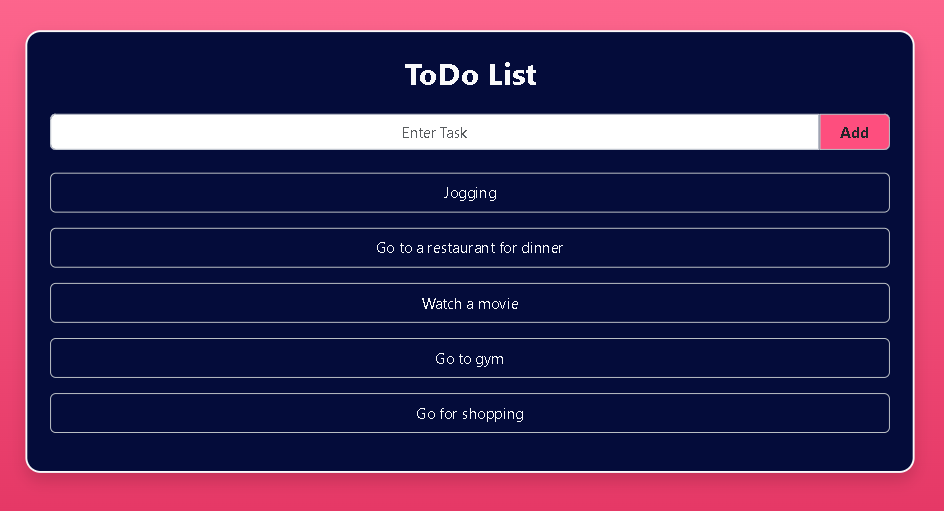
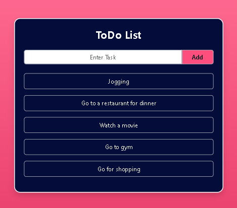
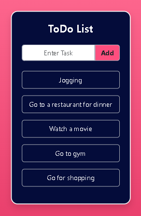

# To-Do List Application Using React, Node, and Express

This project is a To-Do list application developed using React for the frontend and Node.js with Express.js for the backend. Users can easily add and manage tasks through a user-friendly interface. The application utilizes Node-persist to store tasks persistently, ensuring data retention across sessions. Clearing old data upon application startup provides a clean slate for users to start managing their tasks.

## Table of Contents

- [Introduction](#introduction)
- [Features](#features)
- [Installation](#installation)
- [Usage](#usage)
- [Screenshots](#screenshots)
- [License](#license)
- [Additional Information](#additional-information)

## Introduction

This To-Do list application is built using a combination of Node.js and Express.js for the backend and React for the frontend. The user can enter tasks into the input box, which are then securely stored in the Node-persist storage. The tasks are conveniently displayed below in the tasks list section. Upon restarting the application, any old Node-persist data is automatically cleared, providing a fresh start every time.

## Features

- Allows users to add tasks to a to-do list.
- Stores tasks persistently using Node-persist.
- Displays tasks dynamically in a list format.
- Automatically clears old data upon application startup.

## Installation

To install the necessary dependencies for the frontend and backend folders separately, follow these steps:

1. Navigate to the `frontend` folder and then `react-todo` folder run `npm install` to install frontend dependencies.
2. Navigate to the `backend` folder and run `npm install` to install backend dependencies.

## Usage

To run the backend and frontend separately:

1. In the `backend` folder, run `node index.js` to start the backend server on port 5000.
2. In the `react-todo` folder, run `npm start` to start the frontend server.

## Screenshots

<strong>Home</strong>

<strong>Home on iPad</strong>

<strong>Home on Phone</strong>

## License

This project is not licensed.

### Tools Used

- Express.js: Backend server framework.
- React: Frontend library for building user interfaces.
- Node-persist: Local storage for persistently storing tasks.
- UUID: Generates unique identifiers for tasks.
- Body-parser: Middleware for parsing incoming request bodies.
- Cors: Handles cross-origin requests.

## Additional Information

For any questions or further information, please contact [nknithi2018@gmail.com](mailto:nknithi2018@gmail.com).

